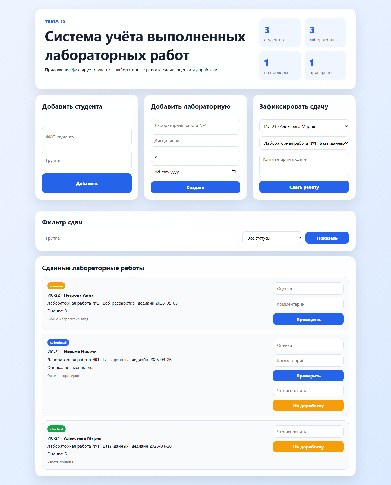

# Дополнение к практической работе. Задания 2-4

Тема 19: Система учёта выполненных лабораторных работ.

Проект представляет собой веб-приложение для контроля сдачи лабораторных работ студентами: ведения списка студентов, лабораторных работ, статусов проверки и оценок.

## Задание 2 - Серверная часть

Серверная часть реализована на Python и Flask. Сервер обрабатывает формы клиента, обращается к SQLite-базе через database.py и возвращает HTML или JSON.

### Структура серверной части

```text
lab-work-accounting-app/
|-- app.py
|-- database.py
|-- lab_works.db
|-- schema.sql
|-- templates/index.html
`-- static/styles.css
```

```text
Браузер -> app.py -> database.py -> lab_works.db
Браузер <- HTML/JSON <- app.py
```

### Основные функции сервера

| Функция/маршрут | Параметры | Что делает | Что возвращает |
|---|---|---|---|
| `index(), GET /` | status, group | Получает студентов, лабораторные, сдачи и статистику. | HTML-страница. |
| `create_student(), POST /students` | full_name, group_name | Добавляет студента. | Redirect на /. |
| `create_lab(), POST /labs` | title, subject, max_score, deadline | Добавляет лабораторную работу. | Redirect на /. |
| `create_submission(), POST /submissions` | student_id, lab_work_id, comment | Фиксирует сдачу работы. | Redirect на /. |
| `check(submission_id), POST /submissions/<id>/check` | score, comment | Проверяет работу и выставляет оценку. | Redirect на /. |
| `api_submissions(), GET /api/submissions` | status, group | Возвращает список сдач. | JSON. |

### Примеры запросов и ответов сервера

```http
GET /api/submissions?status=checked
```

```json
{
  "count": 1,
  "items": [
    {
      "id": 1,
      "full_name": "Алексеева Мария",
      "group_name": "ИС-21",
      "title": "Лабораторная работа №1",
      "score": 5,
      "status": "checked"
    }
  ]
}
```

## Задание 3 - Клиентская часть

Клиентская часть состоит из HTML-страницы и CSS. На странице есть формы добавления студентов и лабораторных работ, форма фиксации сдачи, фильтр и список сданных работ.

### Скриншот главной страницы



### Основные экраны и блоки

| Блок страницы | Назначение |
|---|---|
| Статистика | Показывает количество студентов, лабораторных и проверенных работ. |
| Форма студента | Добавляет студента и группу. |
| Форма лабораторной | Создаёт лабораторную работу с дедлайном. |
| Форма сдачи | Фиксирует факт сдачи работы студентом. |
| Список сдач | Позволяет проверить работу или отправить её на доработку. |

### Схема навигации

```text
Главная / -> POST /students -> /
Главная / -> POST /labs -> /
Главная / -> POST /submissions -> /
Главная / -> POST /submissions/<id>/check -> /
Главная / -> POST /submissions/<id>/revision -> /
```

### Работа кнопок и форм

- Добавить сохраняет студента.
- Создать добавляет лабораторную работу.
- Сдать работу создаёт запись о сдаче.
- Проверить выставляет оценку.
- На доработку меняет статус на revision.

### Запросы клиента к серверу

| Действие пользователя | HTTP-запрос | Данные |
|---|---|---|
| Открыть страницу | `GET /` | Нет или параметры фильтра. |
| Добавить студента | `POST /students` | full_name, group_name. |
| Добавить лабораторную | `POST /labs` | title, subject, max_score, deadline. |
| Зафиксировать сдачу | `POST /submissions` | student_id, lab_work_id, comment. |
| Проверить работу | `POST /submissions/1/check` | score, comment. |
| Получить JSON | `GET /api/submissions` | status, group. |

### Пользовательский сценарий

1. Пользователь открывает главную страницу.
2. Добавляет студента и лабораторную работу.
3. Выбирает студента и лабораторную в форме сдачи.
4. Нажимает Сдать работу.
5. Преподаватель вводит оценку и нажимает Проверить.
6. Если есть ошибки, нажимает На доработку и пишет комментарий.

## Задание 4 - Базы данных

В SQLite-базе lab_works.db хранятся студенты, лабораторные работы и записи о сдаче.

### Структура базы данных

```text
students (1) -> (many) submissions
lab_works (1) -> (many) submissions
```

### Таблица students

| Поле | Тип | Описание |
|---|---|---|
| `id` | INTEGER | Первичный ключ. |
| `full_name` | TEXT | ФИО студента. |
| `group_name` | TEXT | Учебная группа. |
| `created_at` | TEXT | Дата добавления. |
### Таблица lab_works

| Поле | Тип | Описание |
|---|---|---|
| `id` | INTEGER | Первичный ключ. |
| `title` | TEXT | Название лабораторной. |
| `subject` | TEXT | Дисциплина. |
| `max_score` | INTEGER | Максимальный балл. |
| `deadline` | TEXT | Срок сдачи. |
### Таблица submissions

| Поле | Тип | Описание |
|---|---|---|
| `id` | INTEGER | Первичный ключ. |
| `student_id` | INTEGER | Внешний ключ на students.id. |
| `lab_work_id` | INTEGER | Внешний ключ на lab_works.id. |
| `submitted_at` | TEXT | Дата сдачи. |
| `score` | INTEGER | Оценка. |
| `status` | TEXT | submitted, checked или revision. |
| `comment` | TEXT | Комментарий преподавателя. |

### Примеры SQL-запросов

```sql
SELECT * FROM students;
```

```sql
SELECT * FROM submissions WHERE status = 'submitted';
```

```sql
INSERT INTO students (full_name, group_name) VALUES ('Смирнов Олег', 'ИС-22');
```

```sql
SELECT students.full_name, lab_works.title, submissions.score FROM submissions JOIN students ON students.id = submissions.student_id JOIN lab_works ON lab_works.id = submissions.lab_work_id;
```

### Примеры данных в базе

| id | Студент | Группа | Работа | Оценка | Статус |
|---|---|---|---|---|---|
| 1 | Алексеева Мария | ИС-21 | Лабораторная работа №1 | 5 | checked |
| 2 | Иванов Никита | ИС-21 | Лабораторная работа №1 |  | submitted |
| 3 | Петрова Анна | ИС-22 | Лабораторная работа №2 | 3 | revision |

## Вывод

В проекте описаны серверная часть, клиентский интерфейс и база данных системы учёта лабораторных работ. Приложение помогает контролировать сдачу, проверку и доработку работ студентов.
